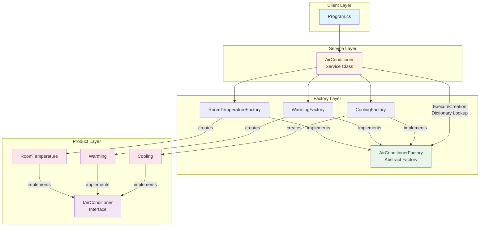
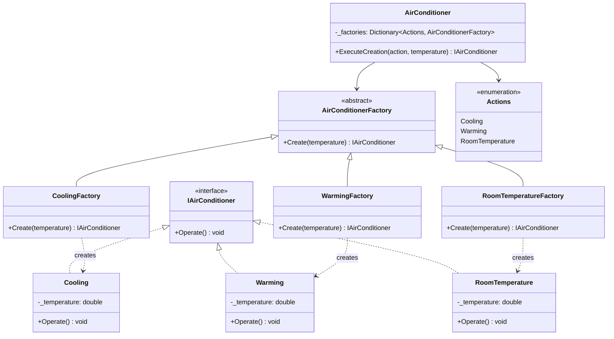

# DesignPatterns

A .NET 8.0 repository demonstrating various design pattern implementations with practical examples.

## Table of Contents
- [Architectural Overview](#architectural-overview)
- [Factory Pattern](#factory-pattern)
- [Building & Running](#building--running)
- [Project Structure](#project-structure)

## Architectural Overview



### Architecture Layers

| Layer | Purpose | Components |
|-------|---------|------------|
| **Client** | Entry point and usage | `Program.cs` |
| **Service** | Factory management & delegation | `AirConditioner` class with Dictionary |
| **Factory** | Object creation abstraction | `AirConditionerFactory` + 3 concrete factories |
| **Product** | Business logic implementation | `IAirConditioner` + 3 concrete products |

---

## Factory Pattern

The Factory Method pattern is a creational design pattern that provides an interface for creating objects without specifying the exact classes to instantiate. This repository demonstrates the pattern using an air conditioning system.

### Class Diagram



### Design Pattern Details

| Element | Type | Description |
|---------|------|-------------|
| `IAirConditioner` | Interface | Defines the contract for all AC operations |
| `AirConditionerFactory` | Abstract Class | Base factory defining creation contract |
| `CoolingFactory` | Concrete Factory | Creates `Cooling` products |
| `WarmingFactory` | Concrete Factory | Creates `Warming` products |
| `RoomTemperatureFactory` | Concrete Factory | Creates `RoomTemperature` products |
| `AirConditioner` | Service Class | Manages factories via Dictionary, delegates creation |

### Usage Example

```csharp
// Create cooling operation at 22.5 degrees
var airConditioner = new AirConditioner();
var cooler = airConditioner.ExecuteCreation(Actions.Cooling, 22.5);
cooler.Operate();

// Create warming operation at 35.0 degrees
var warmer = airConditioner.ExecuteCreation(Actions.Warming, 35.0);
warmer.Operate();

// Create room temperature operation at 32.5 degrees
var roomTemp = airConditioner.ExecuteCreation(Actions.RoomTemperature, 32.5);
roomTemp.Operate();
```

### Key Features
- **Decoupling**: Client code doesn't need to know about concrete AC implementations
- **Extensibility**: Add new AC types by creating new factory and product classes
- **Dictionary-based Registration**: Factories are registered in a Dictionary for dynamic lookup
- **Type Safety**: Enum-based action selection prevents invalid requests

### Running the Factory Example

```bash
# Run the Factory project
dotnet run --project Factory/Factory.csproj

# Or build and run
dotnet build Factory/Factory.csproj
dotnet run --project Factory/Factory.csproj
```

Expected output:
```
Cooling the room to the required temperature of 22.5 degrees
Warming the room to the required temperature of 35.0 degrees
Setting Room temperature to the required temperature of 32.5 degrees
```

---

## Building & Running

### Build entire solution
```bash
dotnet build
```

### Build specific project
```bash
dotnet build Factory/Factory.csproj
dotnet build DesignPatterns/DesignPatterns.csproj
```

### Clean build artifacts
```bash
dotnet clean
```

## Project Structure

```
DesignPatterns/
├── DesignPatterns.sln          # Solution file
├── Factory/                    # Factory Method pattern implementation
│   ├── IAirConditioner.cs      # AC interface
│   ├── AirConditionerFactory.cs # Abstract factory base
│   ├── Cooling.cs              # Concrete product + Factory
│   ├── Warming.cs              # Concrete product + Factory
│   ├── RoomTemperature.cs       # Concrete product + Factory
│   ├── AirConditioner.cs        # Service class
│   ├── Enum.cs                 # Actions enum
│   └── Program.cs              # Entry point
├── DesignPatterns/             # Main project
└── README.md
```

## References
- [Factory Method Pattern - Code Maze](https://code-maze.com/factory-method/)
- [Design Patterns - Gang of Four](https://en.wikipedia.org/wiki/Design_Patterns)
